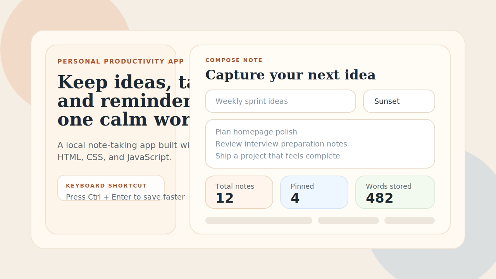

# NoteCraft

NoteCraft is a modern browser-based notes dashboard built to showcase polished frontend fundamentals with plain HTML, CSS, and JavaScript.



## Links

- Repository: https://github.com/vignesh21316/notes-app-portfolio
- Live demo: https://vignesh21316.github.io/notes-app-portfolio/

## Overview

This project started as a simple notes app and was redesigned into a more portfolio-ready product experience. The focus was not only CRUD functionality, but also presentation, interaction quality, and clear state-driven behavior.

## Highlights

- Clean dashboard-style interface with a strong visual identity
- Local-first note persistence using browser LocalStorage
- Fast note workflow with create, edit, pin, copy, delete, search, filter, and sort
- Responsive layout that adapts across desktop and mobile screens
- Keyboard shortcut support with `Ctrl + Enter` for quick saving
- Status messaging, empty states, and live stats for a more complete UX

## Features

- Create notes with title, content, and color accent
- Auto-generate a title when only note content is provided
- Pin important notes so they stay at the top
- Search notes by title or content
- Filter notes by all, pinned, or updated today
- Sort notes by newest, oldest, or alphabetical order
- View dashboard metrics for total notes, pinned notes, and total word count
- Copy note content directly to the clipboard
- Migrate older note data from a simpler LocalStorage structure

## Tech Stack

- HTML5
- CSS3
- Vanilla JavaScript
- Browser LocalStorage

## Project Structure

- `index.html` defines the application layout and semantic structure
- `style.css` contains the visual system, responsive layout, and card styling
- `script.js` manages state, rendering, storage, filtering, and note actions
- `assets/notecraft-preview.svg` provides the GitHub preview graphic

## Why This Is A Strong Portfolio Project

This project demonstrates more than basic frontend syntax. It shows:

- DOM manipulation without depending on a framework
- State-based UI rendering in plain JavaScript
- Data persistence in the browser
- Input validation and defensive handling of stored data
- Responsive UI design and attention to interaction polish
- Refactoring a basic concept into a more complete product experience

## Local Setup

1. Download or clone the repository.
2. Open `index.html` in any modern browser.
3. Start creating notes immediately.

```bash
git clone https://github.com/vignesh21316/notes-app-portfolio.git
```

## GitHub Pages Deployment

After pushing the repo to GitHub, you can publish it with GitHub Pages:

1. Open the repository on GitHub.
2. Go to `Settings > Pages`.
3. Under `Build and deployment`, choose `Deploy from a branch`.
4. Select the `main` branch and the `/ (root)` folder.
5. Save the settings and wait for the site to publish.

Live URL:

```text
https://vignesh21316.github.io/notes-app-portfolio/
```

## Author

Vignesh
